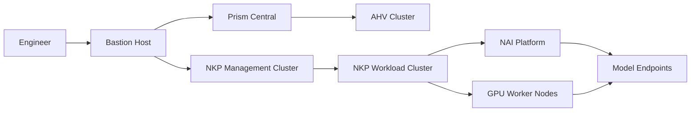
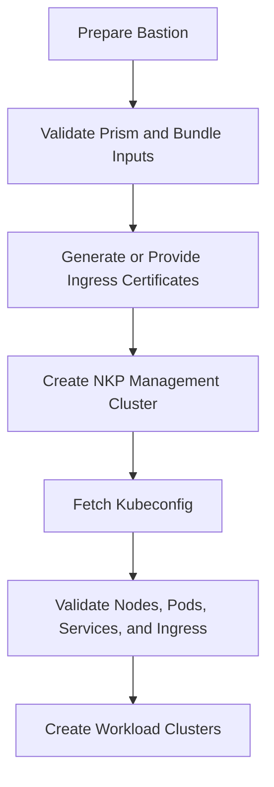
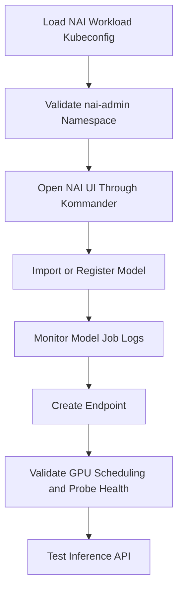

# Architecture

This repository is organized around two related delivery workflows: NKP platform deployment and NAI operations on top of a Kubernetes workload environment.

## High-Level Flow

## NKP Deployment Flow

## NAI Operations Flow

## Security Boundary

The repository contains reusable templates and examples only. Real deployment values must stay in local ignored files:

- `nkp-deployment-kit/config/env_variables.sh`
- `nai-deployment-kit/config/env_nai.sh`
- `certs/`
- `kubeconfigs/`
- `logs/`

These paths are intentionally ignored by Git.
